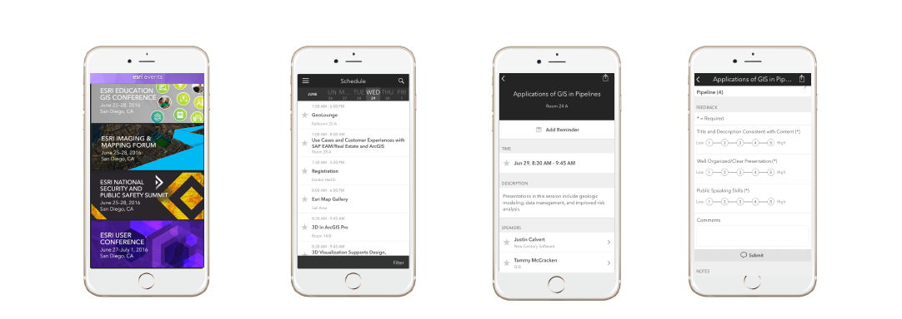

<!-- .slide: data-background="./reveal.js/img/title.png" -->

<!-- Presenter: Matt -->
# ArcGIS API 4.0 for JavaScript: Patterns and Best Practices


## bit.ly/4xpatterns

---


### Kelly Hutchins – [@kellyhutchins](https://twitter.com/kellyhutchins)
### Matt Driscoll – [@driskull](https://twitter.com/driskull)

---

# Agenda

- 4x Goals
- 3x &#8594; 4x Migration
- 4x Signifigant changes
- 4x Tips & Best Practices
- Resources

---

# Goals: 4x JavaScript API

- 2D/3D Visiualization
  - web maps and scenes
- Improved developer experience
  - consistency
  - predictable
  - promises
- Widgets
  - Modernize
  - Library/Framework agnostic
  - User experience
- Enhance documentation
- Improve integration with Portal
- Use cutting edge browser features

---

# Major Design Changes

- Map/View separation
- Widget View/ViewModel separation
- Accessor class
- Autocasting
- Popups

---

# Supported Browsers (modernization)

- Chrome
- Firefox
- Edge
- Safari 7.1+
- OS Safari
- IE11*

*The WebGL implementation of Internet Explorer is not optimized for memory-intensive applications and it might not work reliably when opening certain scenes.

---

<!-- Presenter: Kelly -->
# 4.x Migration


---

# Matrix

---

# CSS Theme

---

# New SDK

---

# More to come
- Still more to do!

---

<!-- Presenter: Matt -->
# 4.x Signifigant changes


---

<!-- Presenter: Matt -->
# Autocasting

```js
var symbol = new SimpleMarkerSymbol({
  style: "diamond",
  color: [255, 128, 45],  // No need to write new Color()
  outline: {              // No need for new SimpleLineSymbol()
    style: "dash-dot",
    color: [255, 128, 45] // Again, no need for new Color()
  }
});
```

VS

```js
var symbol = new SimpleMarkerSymbol({
  style: "diamond",
  color: new Color([255, 128, 45]),
  outline: new SimpleLineSymbol({
    style: "dash-dot",
    color: new Color([255, 128, 45])
  })
});
```

---

# Accessor

- abstract class
- facilitates the access to instance properties
- mechanism to watch for property changes
- inherited by many Esri classes
- Provides a common developer experience

> Inheritance: View &#8594; Accessor

---

# Accessor properties

## Get Property

```js
var basemap = map.basemap;
```

```js
var basemapTitle = map.get("basemap.title");
```

---

# Accessor properties

## Set Property

```js
 view.center = [ -100, 40 ];
 view.zoom = 6;
 map.basemap = 'oceans'; 
```

---

# Accessor properties

## Watch Property

```js
var handle = map.watch('basemap.title',
function(newValue, oldValue, property, object) {
  console.log(newValue, oldValue, property, object);
});
```

---

# watchUtils

- utilities and convenience functions
- for watching Accessor properties

```js
watchUtils.init(accessorClass.property,
function(newValue, oldValue, propertyName, target){
  console.log(newValue, oldValue, propertyName, target);
});
```

[SDK](https://developers.arcgis.com/javascript/latest/api-reference/esri-core-watchUtils.html)

---

# Collections

- generic object
- stores an array of items of the same type
- provides useful utility methods for working with items
  - filter()
  - find()
  - reduce()

examples: map.layers, popup.actions, etc.

---

# Collections: Event

- change event
- fires each time an item is
  - added
  - moved
  - removed

---

# Promises

- handle asynchronous operations
- future value returned
- 3 states
  - pending
  - resolved
  - rejected.
- Methods
  - then

---

# Promises: comparison

## 3.x
```javascript
// map loaded
if (map.loaded) {
  init();
} else {
  on.once(map, 'load', init);
}

```

## 4.x
```javascript
view.then(init);

```

---

# Promises: then()

- commonly used with the .then() method
 - allows you to define the callback and errback functions

```js
someAsyncFunction().then(function(resolvedVal){
  // This is called when the promise resolves
  console.log(resolvedVal);
}, function(error){
  // This function is called when the promise is rejected
  console.error(error);
});
```

---

# Promises: Rejected

When a promise is rejected, it should be handled in an errback function.

---

# Promises: Why?

- Better than an event listener
- Access the result of an asynchronous process directly after it completes
- If you initialize an event listener after an event has occurred then the listener will never fire.

---

# Promises: Learn more

[Working with promises](https://developers.arcgis.com/javascript/latest/guide/working-with-promises/index.html)

---

# Loadable

- Loadable is an extension of promise
- Starts async process once load() is called
- Used on layers
  - Layers shouldn't start async process until needed

---

# Loadable: Layer

Example: layer.load() once layer is added to a view. Otherwise, don't start loading.

[FeatureLayer.load()](https://developers.arcgis.com/javascript/latest/api-reference/esri-layers-FeatureLayer.html#load)

---

# LayerView

- Represents the view for a single layer
  - after it has been added to either a MapView or a SceneView.
- Views have layerViews collection

---

# FeatureLayer

- Can be created from
  - Map service
  - feature service
  - AGOL/Portal items
  - client side graphics
- Supports Map/Scene view
- Client definitionExpression support
- Not currently supported
  - adding geometries
  - deleting geometries
  - editing geometries
- Future editing support

---

# FeatureLayer: Portal Item

```js
// points to a hosted Feature Layer in ArcGIS Online
var fl = new FeatureLayer({
  portalItem: {  // autocasts as esri/portal/PortalItem
    id: "8444e275037549c1acab02d2626daaee"
  }
});
map.add(fl);  // adds the layer to the map
```

---

# FeatureLayer: Graphics

```js
lyr = new FeatureLayer({
   fields: [
   {
     name: "ObjectID",
     alias: "ObjectID",
     type: "oid"
   },...],
   geometryType: "point",
   spatialReference: { wkid: 4326 }
   source: graphics  //  an array of graphics
});
```

---

# Graphics Layer

- Similar to 3x
- Different method calls

[Graphics Layer](https://developers.arcgis.com/javascript/latest/api-reference/esri-layers-GraphicsLayer.html)

---

# Group Layer

- Organize layers into common layer
- Visibility manager
  - listMode
    - show
    - hide
    - hide-children
  - visibilityMode
    - independent
    - inherited
    - exclusive
    
// todo: find scene with group layer to demo

---

# Widgets

- Esri Dijits are now called Widgets
- Simplified getting, setting, and watching widgets to be more simplistic and consistent
- Widgets extend a form of Accessor + _WidgetBase

---

# Widgets: Enhancements

- Combined Attribution and logo widgets into new Attribution widget
- Divided the Locate widget into updated Locate widget and new Track widget
- Updated design to match Esri "Calcite" styling
  - More modern looking
- Added 3D specific widgets
  - [Compass](https://developers.arcgis.com/javascript/latest/api-reference/esri-widgets-Compass.html)
  - [NavigationToggle](https://developers.arcgis.com/javascript/latest/api-reference/esri-widgets-NavigationToggle.html)
- Redesigned Popups

---

# Widgets: View Models

// todo

---

# Widgets: SASS

- Widgets are using SASS

---

# Widgets: Theming

- Sass demo

// todo

---

# Popup Widget

// todo

---

# PopupTemplate

// todo

---

# Widgets: future

- Adding functionality
- Improving UX/UI
- Improving Accessibility
- Still many widgets to port!

---

<!-- Presenter: Kelly -->
# Signifigant changes: Map

- Map.graphics is a collection, not a layer

---

# Basemaps

---

# Signifigant changes: View

---

# Map & View separation

Map (data) and view (presentation) are broken apart.

## 3.x
```javascript
var map = new Map( ... );
```

## 4.x
```javascript
var myMap = new Map({
  basemap: "streets"
});
var view = new MapView({
  map: myMap,  // References a Map instance
  container: "viewDiv"  // References the ID of a DOM element
});
```

---

# Map/View separation: Multiple views

```javascript
require([
  "esri/Map",
  "esri/views/MapView",
  "esri/views/SceneView"
], function(Map, MapView, SceneView) {

  var myMap = new Map({
    basemap: 'streets'
  });

  var 2dView = new MapView({
    map: myMap
  });

  var 3dView = new SceneView({
    map: myMap
  });
});
```

---

# Map/View separation: Camera

---

# Map/View separation: Navigation

view.goTo()

---

# Map/View separation: Demo

---

# Signifigant changes: Webmap + Webscene

---

# Webmap

---

<!-- Briefly -->
# WebScene

---

# Signifigant changes: Portal

---

<!-- Briefly -->
# Portal changes

---

<!-- Presenter: Matt -->
# 4.x Best practices & tips


---

# Accessor

- Get comfortable with Accessor
- Accessor.get("my.property.here");

---

# Widget best practices

---

# Deprecated things

- Modernize your code
- no need for some things
  - lang.hitch
    - use `function(){}.bind(this)`
  - ie11+
  - border containers, form widgets
    - Use css flexbox & native input elements
  - dojo/base/array
    - Use native array functions.

---

# Renamed constant string values

## Kebab-case instead of camelCase

- `simplemarkersymbol` &#8594; `simple-marker-symbol`
- `picturemarkersymbol` &#8594; `picture-marker-symbol`
- `simplelinesymbo`l &#8594; `simple-line-symbol`

---

# Responsive tips

// todo

---

<!-- Presenter: Kelly -->
# Responsive General changes

---

# View padding

---

# UI Components

---

<!-- Presenter: Kelly + Matt -->
# Additional Resources

- Geonet/support/rene/github/sass (Kelly)
- [Documentation - 4.0 beta](https://developers.arcgis.com/javascript/beta/)
- [4x What's new](https://developers.arcgis.com/javascript/latest/guide/whats-new/index.html)
- [4x FAQ](https://developers.arcgis.com/javascript/latest/guide/faq/index.html)

---

# Get The Code

## [bit.ly/4xpatterns](http://bit.ly/4xpatterns)


---

# Please take our survey

## Your feedback allows us to help maintain high standards and to help presenters



---

# Questions?


---


---

<!-- .slide: data-background="./reveal.js/img/end.png" -->
